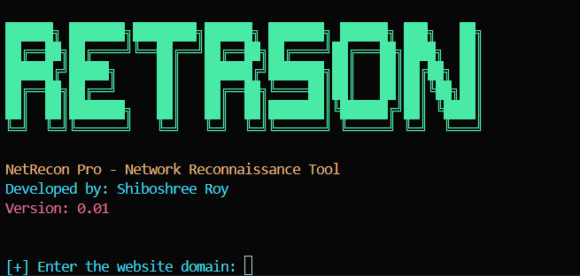

# NetRecon Pro

NetRecon Pro is a powerful and professional network reconnaissance tool designed for ethical hacking and network analysis. It provides detailed information about a target domain, including IP address, DNS records, geolocation, ping results, traceroute, and MAC address (local network only).

---

## Features

- **IP Address Lookup**: Retrieve the IP address of a domain.
- **DNS Records**: Fetch A, MX, and NS records for the domain.
- **Geolocation**: Get detailed geolocation information (country, city, ISP, etc.).
- **Ping**: Check the availability of the server.
- **Traceroute**: Perform a traceroute to the server.
- **MAC Address**: Retrieve the MAC address (local network only).
- **Colorful Output**: Professional and visually appealing output with colorized text.

---

## Installation

1. Clone the repository:
   ```bash
   git clone https://github.com/ShiboshreeRoy/NetRecon-Pro.git
   cd NetRecon-Pro
   ```

2. Install the required dependencies:
   ```bash
   pip install -r requirements.txt
   ```

3. Download the **GeoLite2 City** database from [MaxMind](https://dev.maxmind.com/geoip/geoip2/geolite2/) and place it in the project directory.

---

## Usage

Run the script:
```bash
python NetRecon-Pro
```

Enter the target domain when prompted. The tool will display detailed information about the domain.

---

## Screenshot



---

## License

This project is licensed under the MIT License. See the [LICENSE](LICENSE) file for details.

---

## Developer

- **Shiboshree Roy**
- Version: 0.0.1

---

## Disclaimer

This tool is intended for educational and ethical purposes only. Use it responsibly and only on systems you own or have permission to test. The developer is not responsible for any misuse of this tool.


## **Project Structure**

After creating the above files, your project directory should look like this:

```
NetRecon-Pro/
│
├── NetRecon-Pro.py       # Main Python script
├── README.md             # Project documentation
├── LICENSE               # License file
├── requirements.txt      # Dependencies file
└── GeoLite2-City.mmdb    # MaxMind GeoLite2 database (downloaded separately)
```

---

## **How to Use**

1. Clone the repository:
   ```bash
   git clone https://github.com/ShiboshreeRoy/NetRecon-Pro.git
   cd NetRecon-Pro
   ```

2. Install dependencies:
   ```bash
   pip install -r requirements.txt
   ```

3. Download the **GeoLite2 City** database from [MaxMind](https://dev.maxmind.com/geoip/geoip2/geolite2/) and place it in the project directory.

4. Run the script:
   ```bash
   python NetRecon-Pro.py
   ```

---

## **Screenshot**

Replace the placeholder link in the `README.md` with an actual screenshot of the tool in action. For example:


---

## **Disclaimer**

This tool is for educational and ethical purposes only. Use it responsibly and only on systems you own or have permission to test. The developer is not responsible for any misuse of this tool.

